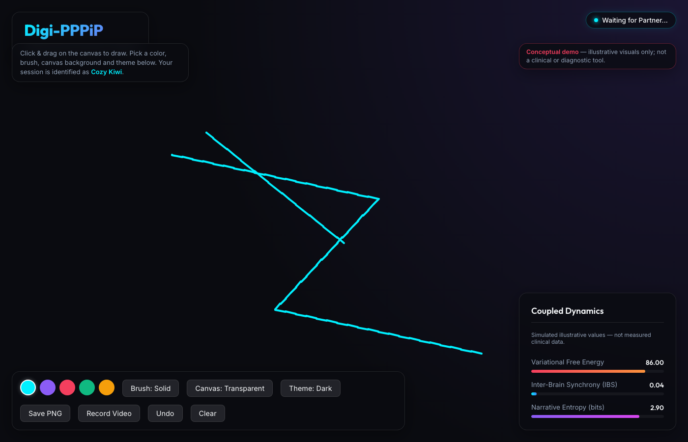
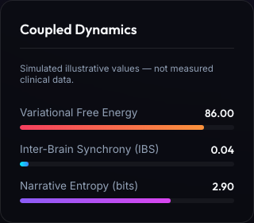

# Digi-PPPiP — Digital Partner Pen Play in Parallel

> **Digital Partner Pen Play in Parallel** — a cyberphysical, temporal,
> active-inference, neuroergonomic, phenomenological, accessibility, and
> place-based successor to PPPiP (Mikhailova & Friedman, 2018).
>
> A composable, fully-tested computational companion and interactive web
> instantiation of the DigiPPPiP framework, rendered as a governed research
> manuscript.

| | |
|---|---|
| **Version DOI (this release)** | [10.5281/zenodo.21815705](https://doi.org/10.5281/zenodo.21815705) |
| **Concept DOI (family)** | [10.5281/zenodo.21815704](https://doi.org/10.5281/zenodo.21815704) |
| **Zenodo record** | [https://zenodo.org/records/21815705](https://zenodo.org/records/21815705) |
| **GitHub release** | [digi-pppip v1.0.0](https://github.com/docxology/Digi-PPPiP/releases/tag/v1.0.0) |
| **Rendered PDF** | [`Digi-PPPiP_combined.pdf`](Digi-PPPiP_combined.pdf) (repo root) and [`output/pdf/digi-pppip_combined.pdf`](output/pdf/digi-pppip_combined.pdf) |
| **Cover art** | [`manuscript/cover.png`](manuscript/cover.png) (symbolic) |

## What this is

DigiPPPiP treats the "paper" in PPPiP as a variable cyberphysical substrate —
shared tablets, web canvases, AR/VR spaces, and persistent whiteboards — and
studies two partners coupling through a shared mark field under an active
inference lens. It is **not** a claim of therapeutic efficacy, neural-synchrony
causality, universal accessibility, or AI benefit: those remain empirical
questions for the controlled studies the manuscript designs.

This repository is the **governed source-of-truth package and manuscript**. It
ships typed, tested Python primitives in `src/`, a modular Pandoc manuscript in
`manuscript/`, a **live interactive web app** in `web-app/` (a working
instantiation of the design kernel), generated figures and build outputs in
`output/`, and a no-mocks test suite with a 90% coverage gate.

> All computational illustrations and the app's live dashboard metrics are
> **deterministic conceptual models / simulated illustrative values**, not
> empirical fNIRS/EEG findings. See the manuscript's "Evidence Scope and
> Non-Claims" section.

## Interactive web instantiation

`web-app/` is a self-contained React (Vite) + Socket.IO demo that realizes the
minimum viable kernel: two partners, a shared low-latency drawing surface,
perceptible traces of agency, and consentful control over persistence. Its
live "Coupled Dynamics" dashboard shows *simulated* Variational Free Energy,
Inter-Brain Synchrony, and Narrative Entropy with an explicit "not measured
clinical data" disclaimer.




Run it:

```bash
cd web-app/server && npm install && node index.js      # Socket.IO on :3001
cd web-app/client && npm install && npm run dev         # Vite on :5173
```

Open `http://localhost:5173` in two windows to draw together. The four screenshots
under `web-app/screenshots/` are also registered as governed figures in the
manuscript (see `src/figure_catalog.py`; 39 registered figures total).

## Repository layout

```
src/                 pure tested primitives (90% coverage gate)
  metrics.py           SINGLE numeric authority (covered, tested)
  active_inference.py  dyadic coupled variational free energy
  hyperscanning.py     inter-brain synchrony + Forman–Ricci curvature
  narrative.py         narrative information theory (entropy/surprisal)
  ... (taxonomy, aesthetics, neuroergonomics, session_events, outcomes,
       accessibility, source_quality, claim_ledger, source_verification,
       study_readiness, systems_governance, figure_methods,
       figure_artifact_audit, figure_catalog, provenance, evidence,
       figures, manuscript_variables)
scripts/             thin orchestrators
manuscript/          modular Pandoc sections + config/preamble/SYNTAX/bib
web-app/             React + Socket.IO interactive instantiation + screenshots
output/              generated figures, PDF, web, slides, data, reports
tests/               no-mocks pytest suite
docs/                factored technical docs (architecture/figures/testing/scholarship)
ISA.md, AGENTS.md, RENDERING.md
```

## Validation (standalone quality gate)

```bash
uv run python scripts/digippppip_figures.py          # 39 figures → output/figures/
uv run python scripts/z_generate_manuscript_variables.py
uv run pytest tests --cov=src --cov-branch --cov-report=term-missing --rootdir . --cov-fail-under=90
uv run ruff check src tests scripts
uv run mypy src tests scripts
```

Baseline: **39 registered figures, 128 tests, ≥95% line+branch coverage**
(97.45% with the pinned dev toolchain), ruff + mypy clean, figure-artifact
audit score 1.0, and a green template prerender. Coverage is enforced at 90%.

## Render the paper

This repo has no renderer of its own; it renders as a **sidecar** of the
[`docxology/template`](https://github.com/docxology/template) research pipeline.
Place (or symlink) it at `template/projects/working/digi-pppip`, then from the
template root:

```bash
.venv/bin/python -m infrastructure.validation.cli prerender \
  projects/working/digi-pppip/manuscript --repo-root .
.venv/bin/python scripts/pipeline/stage_03_render.py --project working/digi-pppip
```

The combined PDF is written to `output/pdf/digi-pppip_combined.pdf`; a copy is
also kept at the repo root as `Digi-PPPiP_combined.pdf`. Full two-repo
instructions: **[`RENDERING.md`](RENDERING.md)**.

## Publication & DOI

A real DOI was minted for v1.0.0 on a Zenodo deposit:

- **Version DOI:** `10.5281/zenodo.21815705` — resolves to the published v1.0.0 record.
- **Concept DOI:** `10.5281/zenodo.21815704` — the version-agnostic family identifier.
- **Record:** <https://zenodo.org/records/21815705>
- **GitHub release:** <https://github.com/docxology/Digi-PPPiP/releases/tag/v1.0.0>

The DOI is written into the manuscript title page and
`manuscript/config.yaml` (`publication.doi`, `publication.version_doi`).
Suggested citation:

> Shrivastava, S., Goh, E. C., Mikhailova, A., & Friedman, D. A. (2026).
> *DigiPPPiP: Digital Partner Pen Play in Parallel*. Zenodo.
> https://doi.org/10.5281/zenodo.21815704

## Numeric-authority rule

Every number that reaches the manuscript is computed by `src/metrics.py`
(tested, coverage-enforced), serialized to
`output/data/digippppip_metrics.json`, and hydrated via
`src/manuscript_variables.py`. `src/figures.py` renders only. Quoted manuscript
`{{TOKEN}}` values are bound to this authority; tests (e.g.
`tests/test_integration_consistency.py`) enforce figure/token/citation/article
cross-artifact integrity.

## Scholarship and claims

The manuscript separates peer-reviewed sources, theory books, preprints,
reports, and official governance anchors through `src/source_quality.py` and
`src/source_verification.py`. Each citekey is verified (title, venue, year,
DOI or stable URL) before it is added; Perplexity/web results are discovery
leads only. Every figure is a small reproducible claim object (see the
caption contract in `src/figure_methods.py` and the artifact audit in
`src/figure_artifact_audit.py`).

## License

`MIT` (see `manuscript/config.yaml` → `metadata.license`) unless a specific
subdirectory states otherwise.
