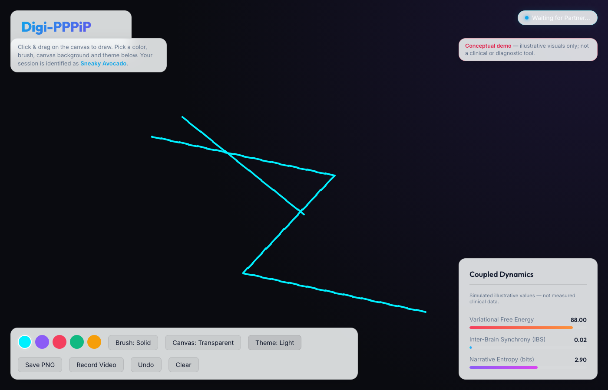
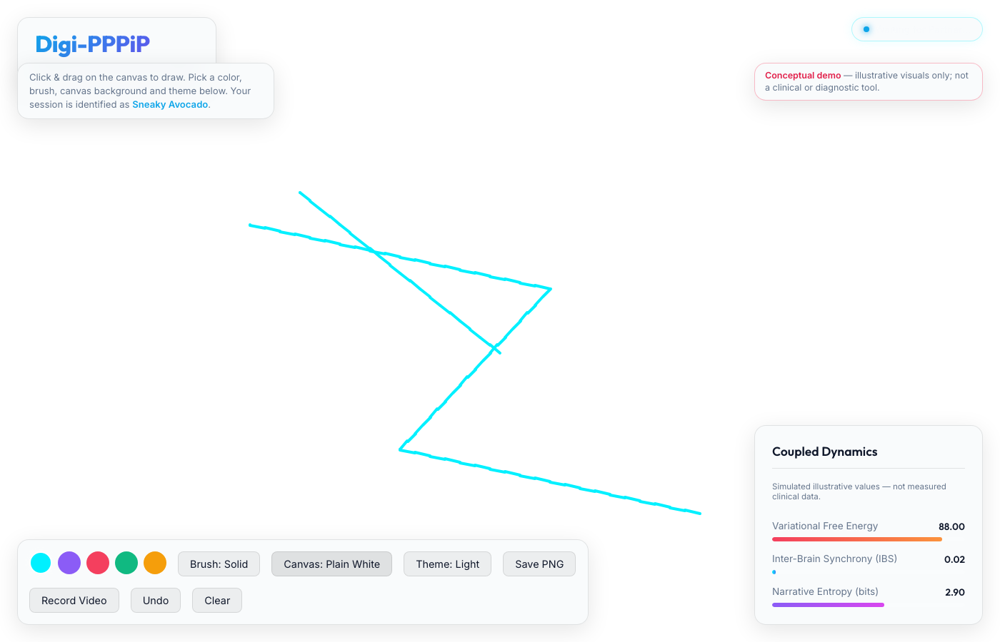

# Digi-PPPiP Web App
**Digital Partner Pen Play in Parallel**

Welcome to the interactive web instantiation of the Digi-PPPiP framework. This application serves as a real-time, collaborative digital canvas designed to demonstrate the principles of dyadic coupled active inference and neuroergodynamics.

## 🧠 The Concept: Digi-PPPiP

Digi-PPPiP explores the mechanics of human-to-human (and potentially human-to-agent) interaction when bound together in a shared digital task. In this app, two or more individuals connect to a shared canvas. As they draw together, they are engaged in "Parallel Pen Play." 

Through the lens of the **Active Inference** framework (originally proposed by Karl Friston), human brains act as prediction engines, constantly striving to minimize "surprise" or **Variational Free Energy**. When two individuals collaborate closely, they form a coupled system. Over time, as their interactions synchronize, their combined Free Energy decays, indicating an increase in mutual predictability and **Inter-Brain Synchronization (IBS)**.

### Live Metrics Dashboard
The application features a real-time dashboard that visually simulates these theoretical primitives based on the coupling state of the users:
- **Variational Free Energy**: Tracks the system's "surprise." It naturally increases when isolated but decays steadily toward an optimal lower bound when users are actively coupled.
- **Inter-Brain Synchronization (IBS)**: Represents the neurological coupling between partners, rising dynamically during parallel play.
- **Narrative Entropy**: Spikes dynamically based on the velocity and length of the strokes drawn, reflecting moments of sudden cognitive or mechanical divergence, before settling back into equilibrium.

---

## ✨ Features

- **Real-Time Multiplayer**: Built on low-latency WebSockets (Socket.IO). Mouse movements and drawn paths are instantly synchronized across all connected peers.
- **Dynamic Identification**: No more generic "Partner" labels. Every user is randomly assigned a playful `Adjective-Fruit` moniker (e.g., *Spicy Mango*, *Derpy Kiwi*) upon connection, which tracks their cursor globally.
- **Stroke History & Safe Undo**: Employs an intelligent stroke-tracking architecture. Clicking `Undo` securely removes your last drawn stroke and broadcasts the rollback to your partners without disrupting their art.
- **Glassmorphic Aesthetic UI**: A premium, frosted-glass design system. 
- **Theming & Accessibility**: Select between multiple UI themes (`Dark`, `Light`, `Comfort`) and independent `Canvas` backgrounds (`Plain Black`, `Plain White`, `Warm Paper`, or `Transparent`).
- **Expressive Tools**: Swap seamlessly between `Solid`, `Dotted`, and `Neon` (HTML5 Canvas `shadowBlur`) brush styles.
- **Session Export**:
  - **Save PNG**: Export a snapshot of the current canvas, completely compositing your selected canvas background color behind the strokes.
  - **Record Video**: Utilizes the native browser `MediaRecorder` API to capture and stitch a high-framerate `.webm` video of your collaborative session.

---

## 🛠️ Tech Stack & Architecture

This repository is built with a decoupled client/server architecture:
- **Frontend (`client/`)**: React (18), Vite, standard CSS3 (CSS Variables for theming).
- **Backend (`server/`)**: Node.js, Express, Socket.IO.
- **State Management**: The UI is governed by standard React hooks. The canvas rendering bypasses React's virtual DOM, directly utilizing the HTML5 `<canvas>` API via `useRef` for high-performance 60fps rendering, avoiding render bottlenecks during heavy path interpolation.

---

## 🚀 Getting Started

This project is fully self-contained. You will need [Node.js](https://nodejs.org/) installed on your machine.

### 1. Start the WebSocket Server
The server handles the rapid relay of coordinate data and connection management.
```bash
cd server
npm install
node index.js
```
*The server will run on `http://localhost:3001`.*

### 2. Start the React Client
Open a new terminal window to start the frontend development server.
```bash
cd client
npm install
npm run dev
```
*The client will be accessible at `http://localhost:5173`.*

### 3. Connect Partners
Open `http://localhost:5173` in multiple browser windows (or different devices on the same local network). You will immediately be assigned a fruit nickname, and your cursors will become visible to each other. 

Begin drawing to observe the live effects on the Coupled Dynamics dashboard!

> **Note on the Socket.IO server**: by default the server allows the Vite dev origin
> (`http://localhost:5173`). If you run the client on a different port or host, pass the
> client origin(s) explicitly:
> ```bash
> CORS_ORIGIN="http://localhost:5173,http://localhost:3000" node index.js
> ```

---

## 📸 Screenshots

The app running against the local Socket.IO server (captured with Playwright headless Chromium):

| Main canvas (dark theme) | Coupled Dynamics dashboard |
|---|---|
|  |  |

| Light theme | Themes & settings (light + white canvas) |
|---|---|
|  |  |

Screenshots live under [`screenshots/`](screenshots/) and were captured from the running
dev stack — they reflect actual rendering, not a mockup. A small Playwright script
(`screenshot.js`) reproduces them; install it with `npm install` at the `web-app/` root and
run `node screenshot.js` with both servers started.

---

## ⚠️ Scope & disclaimer

This is a **conceptual, illustrative demo** of coupled active-inference ideas. The metrics
shown live (Variational Free Energy, Inter-Brain Synchrony, Narrative Entropy) are
**simulated values for demonstration** — they are not measured clinical or diagnostic data,
and the app is not a medical or clinical tool.
